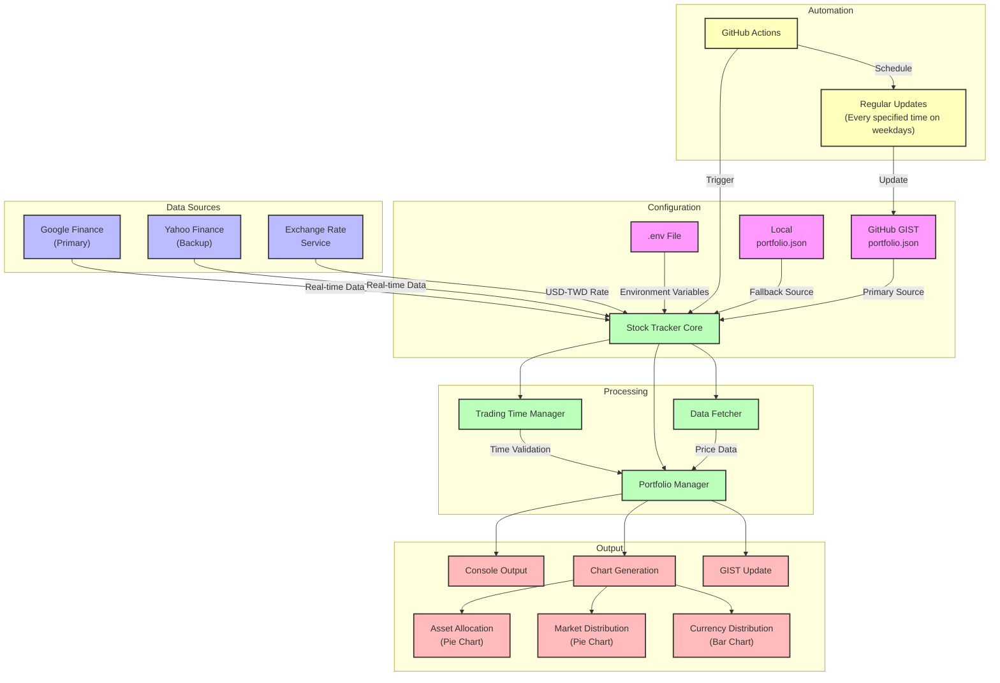

# Stock Tracker

A Python tool for retrieving real-time stock prices from Google Finance and Yahoo Finance, supporting stock price queries across multiple exchanges and currency conversion, with intelligent trading time detection.

## Architecture



## Features

- Multiple Data Sources
  - Google Finance (primary source)
  - Yahoo Finance Taiwan (backup source, supports special stock codes like OTC market)
- Intelligent Trading Time Management
  - Automatic market trading time detection
  - Support for US stock market DST/ST automatic switching
  - Price updates only during trading hours
- Real-time Currency Conversion
  - Automatic USD-TWD exchange rate from Google Finance
  - Exchange rates displayed to two decimal places
- Portfolio Visualization
  - Asset allocation pie chart
  - Market distribution pie chart
  - Currency distribution bar chart
  - Full Traditional Chinese display support
- Modular design, easy to extend
- Support for multiple exchanges

## System Requirements

- Python 3.8 or higher
- pip (Python package manager)
- venv (Python virtual environment tool)
- tzdata (timezone data)
- matplotlib (chart generation, optional)

## Quick Installation

1. Clone or download the project:

```bash
git clone <repository-url>
cd stock_tracker
```

2. Installation commands:

```bash
# Remove old virtual environment (if exists)
rm -rf venv && \
# Create new virtual environment
python3 -m venv venv && \
# Activate virtual environment
source venv/bin/activate && \
# Install dependencies
pip install -r requirements.txt && \
# Install project
pip install -e . && \
# Install chart support (optional)
pip install matplotlib && \
# Test execution
python -m stock_tracker portfolio
```

## Usage

### Required Configuration

Before using the program, you need to set up the following:

1. GitHub GIST Configuration (Primary Method):
   Create a `.env` file in the project root directory with your GitHub GIST credentials:

```env
GIST_ID=your_gist_id
GIST_TOKEN=your_github_personal_access_token
BASE_URL=https://www.google.com/finance/quote/
TIMEZONE=Asia/Taipei
USER_AGENT=Mozilla/5.0
REQUEST_TIMEOUT=10
MAX_RETRIES=3
```

2. Local Portfolio File (Fallback Method):
   Create a `portfolio.json` file in the project root directory to store portfolio information:

```json
{
  "totalValue": 6088899.07,
  "exchange rate": "32.08",
  "stocks": [
    {
      "name": "2330:TPE",
      "price": 1060.0,
      "quantity": 1000,
      "currency": "TWD",
      "lastUpdated": "2024-10-24T16:54:35+08:00",
      "percentageOfTotal": 17.41
    },
    {
      "name": "TSLA:NASDAQ",
      "price": 213.65,
      "quantity": 106,
      "currency": "USD",
      "lastUpdated": "2024-10-24T17:30:28+08:00",
      "percentageOfTotal": 11.93
    }
  ]
}
```

The program will first try to read from the configured GIST, and if unavailable, will fall back to the local portfolio.json file.

### GitHub Actions Integration

The repository includes GitHub Actions workflow for automated portfolio updates:

1. Create GitHub Secrets for your repository:
   - `GIST_ID`: Your GitHub GIST ID
   - `GIST_TOKEN`: Your GitHub Personal Access Token with gist scope

2. The workflow will automatically:
   - Run at scheduled intervals
   - Update portfolio data
   - Generate new charts
   - Update the GIST with latest data

Example workflow file (.github/workflows/update-portfolio.yml):

```yaml
name: Update Portfolio

on:
  schedule:
    - cron: '30 3 * * 1-5'  
    - cron: '30 5 * * 1-5'  
    - cron: '30 21 * * 0-5'
  workflow_dispatch:

env:
  GIST_ID: ${{ secrets.GIST_ID }}
  GIST_TOKEN: ${{ secrets.GIST_TOKEN }}

jobs:
  update-portfolio:
    runs-on: ubuntu-latest
    steps:
      - uses: actions/checkout@v4
      
      - name: Set up Python
        uses: actions/setup-python@v5
        with:
          python-version: '3.10'
          
      - name: Cache pip packages
        uses: actions/cache@v4
        with:
          path: ~/.cache/pip
          key: ${{ runner.os }}-pip-${{ hashFiles('requirements.txt') }}
          restore-keys: |
            ${{ runner.os }}-pip-
            
      - name: Install dependencies
        run: |
          python -m pip install --upgrade pip
          pip install -r requirements.txt
          pip install -e .
          
      - name: Check environment
        run: |
          echo "Checking environment variables..."
          if [ -n "$GIST_ID" ]; then
            echo "GIST_ID is set"
          else
            echo "GIST_ID is not set"
          fi
          if [ -n "$GIST_TOKEN" ]; then
            echo "GIST_TOKEN is set"
          else
            echo "GIST_TOKEN is not set"
          fi
          echo "Current directory: $(pwd)"
          echo "Directory contents:"
          ls -la
          
      - name: Update portfolio
        run: |
          echo "Starting portfolio update..."
          python -m stock_tracker portfolio --debug
        env:
          GIST_ID: ${{ secrets.GIST_ID }}
          GIST_TOKEN: ${{ secrets.GIST_TOKEN }}
          PYTHONPATH: ${{ github.workspace }}/src
          
      - name: Upload logs
        if: always()
        uses: actions/upload-artifact@v4
        with:
          name: portfolio-logs
          path: |
            logs/*.log
            *.log
```

### Command Line Interface

The program supports multiple operation modes:

1. Update and display complete portfolio:

```bash
python -m stock_tracker portfolio
```

2. Update portfolio and generate visualization charts:

```bash
python -m stock_tracker portfolio --charts
```

3. Specify chart output directory:

```bash
python -m stock_tracker portfolio --charts --output-dir my_charts
```

4. Query specific stock prices in real-time:

```bash
python -m stock_tracker query TSLA:NASDAQ VTI:NYSEARCA 2330:TPE
```

5. Use a specific portfolio file:

```bash
python -m stock_tracker portfolio --file my_portfolio.json
```

[Rest of the content remains the same as the original, including Chart Features, Python Usage, Directory Structure, Trading Time Management, Supported Exchanges, Development Guide, Troubleshooting, and Version History sections]

## License

MIT License

## Contributing

Feel free to submit Issues or Pull Requests to improve the project. Before submitting, please ensure:

1. New features are thoroughly tested
2. Documentation is updated
3. Existing code style is followed